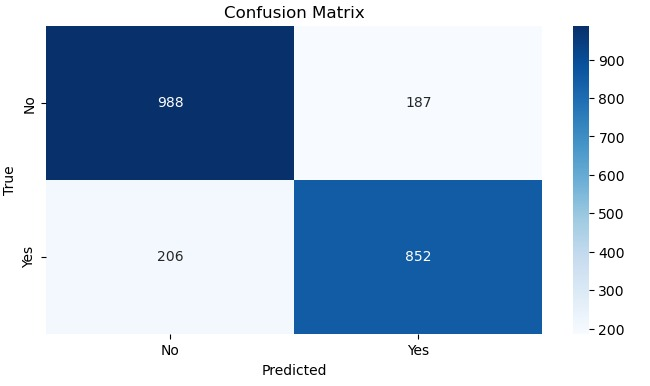
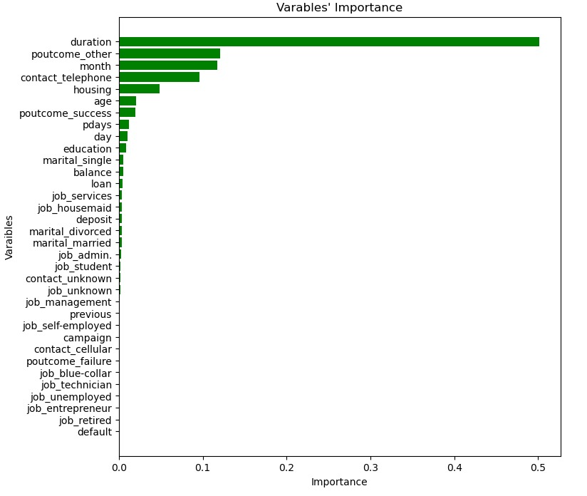

# Decision Tree Classifier for Bank Deposit Prediction
## Overview

This project aims to predict whether a customer will subscribe to a deposit product using a dataset of customer attributes such as age, job, marital status, and account balance. A Decision Tree classifier is used to make predictions based on the given features.

## Table of Contents

1. [Installation](#installation)
2. [Data Collection](#data-collection)
3. [Data Cleaning](#data-cleaning)
4. [Model Building](#model-building)
5. [Results](#results)
6. [Contributing](#contributing)
7. [License](#license)
8. [Contact](#contact)

## Installation

To run this project, ensure you have the following Python libraries installed:
---bash
import pandas as pd
import numpy as np
import matplotlib.pyplot as plt
from matplotlib.colors import ListedColormap
import seaborn as sns
import warnings
from kaggle.api.kaggle_api_extended import KaggleApi
from sklearn.preprocessing import LabelEncoder, StandardScaler
from sklearn.model_selection import train_test_split, cross_val_score
from sklearn.tree import DecisionTreeClassifier
from sklearn.metrics import accuracy_score, classification_report, confusion_matrix

## Data Collection

The dataset used in this project is the **Bank Marketing Dataset** from Kaggle, available at [rouseguy/bankbalanced](https://www.kaggle.com/datasets/rouseguy/bankbalanced). It includes customer information along with whether they subscribed to a deposit (`yes` or `no`).

## Data Cleaning

The data cleaning process involved several steps to prepare the dataset for analysis and modeling:

- **Handling Missing Data**: Missing values were handled by replacing them with the most frequent value in the respective column.
- **Encoding Categorical Variables**: Categorical features like `job` and `education` were encoded into numerical values using `LabelEncoder`.
- **Feature Scaling**: Features such as `age` and `balance` were scaled using `StandardScaler` to ensure the model treats them equally.
- **Data Splitting**: The dataset was split into training and testing sets using `train_test_split`.

## Model Building

A **Decision Tree Classifier** was used to predict whether a customer will subscribe to a deposit. 

  

The model was trained on the cleaned and preprocessed dataset.
- **Training**: The model was trained on the training set with hyperparameters tuned for better performance.
- **Evaluation**: The model's performance was evaluated using accuracy, precision, recall, and F1-score.

<table>
  <tr>
    <td align="center">
      
    </td>
    <td align="center">
      
    </td>
  </tr>
</table>

- The plots above show how my machine learning model makes decisions about whether a bank customer will make a deposit or not. Think of it like a map where the x-axis shows customer age and the y-axis shows their housing status. The colored backgrounds work like a territory map: pink areas are where the model predicts "No Deposit," and green areas are where it predicts "Deposit." The dots represent actual customers - red dots for customers who didn't make deposits and green dots for those who did.

- I have created two maps: one for training data (what the model learned from) and one for testing data (new cases it hadn't seen before). The rectangular patterns you see are like decision rules - for example, "if a customer is this age AND has this housing status, they're likely to make a deposit." When you see a red dot in a pink area or a green dot in a green area, that means our model made the right prediction. Dots in the wrong colored areas show where my model made mistakes.

- What makes these visualizations valuable is that they show how well my model is working. The similar patterns between training and test sets tell us the model has learned genuine patterns rather than just memorizing data. We can also see that age seems to play a big role in deposit decisions (shown by the many vertical lines), and that older customers (right side) are generally more likely to make deposits (more green areas). This kind of visualization helps banks understand their customers better and make more informed decisions about their services.

## Results

<table>
  <tr>
    <td align="center">
      
    </td>
    <td align="center">
      
    </td>
  </tr>
</table>

The classification report provides a summary of the model's performance across key metrics for each class (0: No Deposit, 1: Deposit):

- Precision: For class 0 (No Deposit), precision is 0.83, meaning 83% of predicted "No Deposit" cases are correct. For class 1 (Deposit), precision is 0.80, indicating 80% of "Deposit" predictions are correct.

- Recall: For class 0, recall is 0.81, meaning 81% of actual "No Deposit" cases were correctly identified. For class 1, recall is 0.82, meaning 82% of actual "Deposit" cases were correctly identified.

- F1-Score: A balance between precision and recall, showing the overall effectiveness for each class: 0.82 for class 0 and 0.81 for class 1.

- Support: The number of instances in each class: 1166 for class 0 and 1067 for class 1.

**Overall performance:**

- Accuracy: The model correctly predicted 81% of all cases.

- Macro Average: A simple average of precision, recall, and F1-score for both classes (0.81).

- Weighted Average: Accounts for class imbalance by weighting metrics based on the number of instances in each class (also 0.81).

This report indicates the model performs similarly well for both classes, with slightly better precision for "No Deposit" and recall for "Deposit."

## Feature Importance

Explore the most important features in predicting whether a customer subscribes to a deposit from the plot below:

  

- The variable importance values indicate how much each feature contributes to the decision tree model's predictions. The most influential feature is duration (0.471144), which has the highest importance score and plays a significant role in determining whether a customer will make a deposit.

- On the other hand, default (0.000000) and loan (0.001221) are the least significant features, with minimal influence on the model's output.

- This ranking of variable importance helps in understanding the key drivers of the model's predictions and can guide future efforts in model optimization or feature selection.

## Contributing

Contributions are welcome!

---

## License

This project is licensed under the MIT License. See the [LICENSE.md](LICENSE.md) file for details.

## Contact

If you have any questions or need further assistance, feel free to reach out:
Hermela Seltanu
LinkedIn: [Hermela Seltanu](https://www.linkedin.com/in/hermelaseltanu/)
